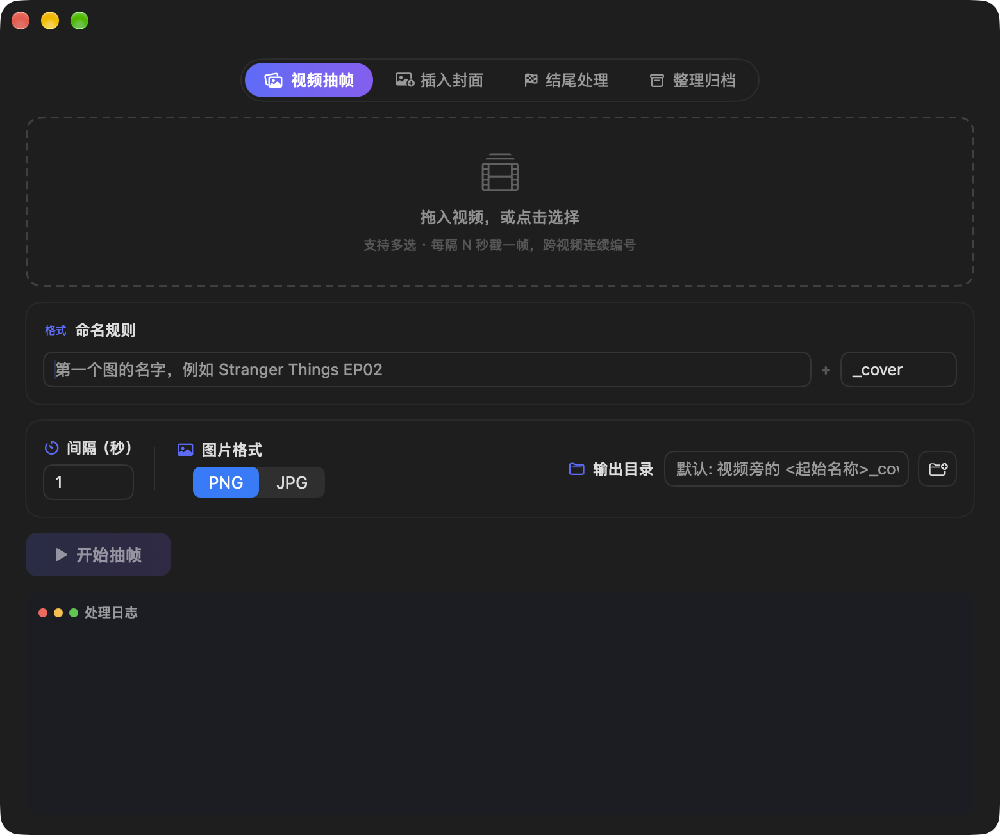
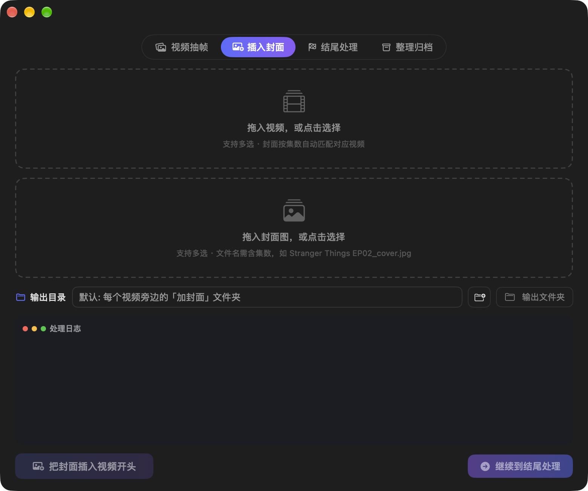
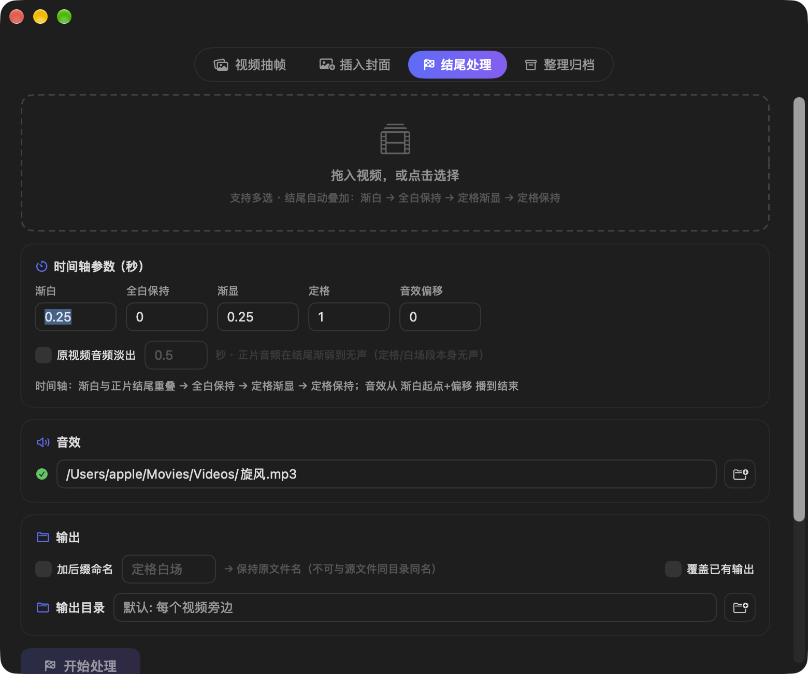
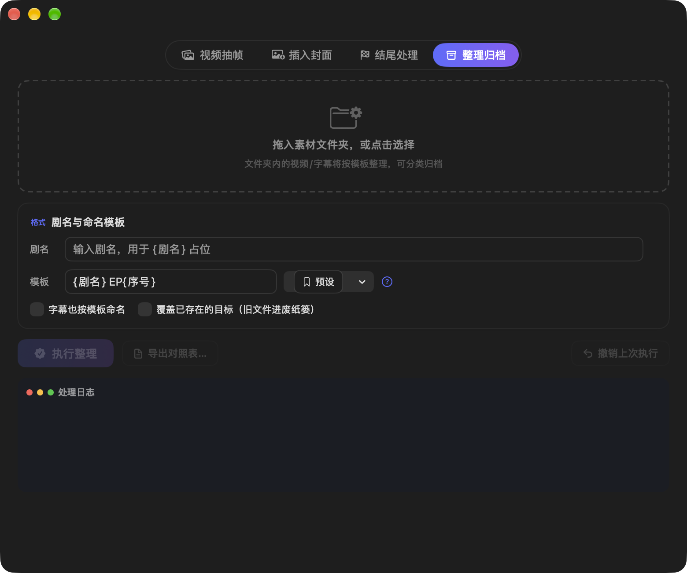

# Video Post-Production

一款为短剧/批量视频后期处理打造的 macOS 原生工具（SwiftUI + 内置 ffmpeg），把「抽帧、封面、结尾效果、整理归档」四件事装进一个 App。

  

## 功能板块

### 1. 视频抽帧



- 拖入视频（或文件夹），按设定间隔/数量抽取帧图
- 支持自定义输出目录、PNG/JPG 格式、命名规则

### 2. 插入封面



- 为视频开头插入一张封面帧（单图或整个封面目录，自动按集数配对，如 EP21 ↔ 封面21）
- 右下角「继续到结尾处理」按钮：一键把视频和封面带到结尾处理板块，合并成一次编码，避免二次转码

### 3. 结尾处理


结尾时间轴：**渐白 → 全白保持 → 定格渐显 → 定格保持**，可叠加：
- 🎵 音效（自动对齐到结尾段起点）
- 🔊 原视频音频淡出（可调时长）
- 📁 输出目录 / 加后缀命名 / 覆盖已存在文件
- 处理日志实时滚动显示

### 4. 整理归档



- 按模板批量重命名：`{剧名} EP{序号}` 等，序号自动补零
- 自动分类到「字幕 / 纯净 / 成片」三个子文件夹
- 重复/冲突检测、模板自动补扩展名、一键撤销上次整理

## 运行要求

- macOS（Apple Silicon）
- **无需安装 ffmpeg** —— 已内置到 App 包内（静态编译版 ffmpeg + ffprobe）

## 使用方式

双击 `build/Video Post-Production.app` 即可。

> 首次打开若被 Gatekeeper 拦截：右键 → 打开；或终端执行
> `xattr -dr com.apple.quarantine "Video Post-Production.app"`

## 从源码构建

```bash
# 编译 GUI App（Bundle 结构见 build/ 下的现成 App）
swiftc -O -parse-as-library Logic.swift App.swift -o VideoFrameTool

# 或编译命令行版
swiftc -O main.swift Logic.swift -o VideoPostCLI
```

### 命令行示例

```bash
# 结尾处理（含音效 + 音频淡出 + 封面一次编码）
./VideoPostCLI --ending 视频/ --cover 封面/ --sfx 音效.m4a \
  --afade 1.0 --hold 1.0 --fade-in 0.25 --freeze 1.0 \
  --suffix 结尾 --out 输出/

# 整理归档（按模板重命名 + 分类夹）
./VideoPostCLI --cli 视频目录/ 剧名 --execute

# 撤销上次整理
./VideoPostCLI --undo
```

## 项目结构

```
├── App.swift        # SwiftUI 界面（四大板块 + 通用组件）
├── Logic.swift      # 引擎：抽帧/封面/结尾(EndingEngine)/整理(DramaOrganizer)
├── main.swift       # CLI 入口与路由
└── build/           # 现成的 App（内置 ffmpeg）
```

## 设计说明

- 所有设置通过 `@AppStorage`（UserDefaults）持久化，重开 App 自动恢复
- 内置 ffmpeg 定位优先级：App 包内 Resources → `~/.local/bin` → `/opt/homebrew/bin` 等系统路径
- 重命名带防呆护栏：模板不含 `{扩展名}` 时自动补全；同名同目录输出会被拒绝，防止顶掉源文件
